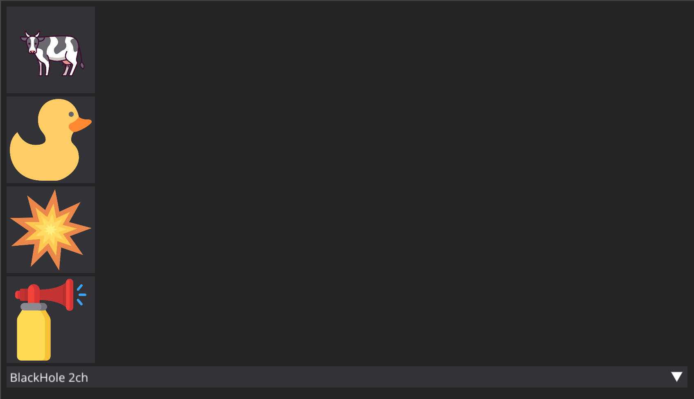

# Supertanker

A cross-platform GUI soundboard app that allows you to play sound effects (mp3 files) into your microphone

Requirements
- virtual mic device (Mac: Blackhole, windows: VB cable etc)
- [sounddevice](https://pypi.org/project/sounddevice/)
- [soundfile](https://pypi.org/project/soundfile/)
- [DearPyGui](https://github.com/hoffstadt/dearpygui)
- Python (built on 3.14)

How to use:

- clone repo or download .app from releases

- Run executable to launch application, any errors will be printed in the log

- no need to download additional data (included sfx, font, etc), they will be downloaded into your home folder if not present

- In the drop down at the bottom of the window, select your virtual audio device

- Now press a button and play!!!

Comes with (all from myinstants):

Cow moo 

Vine boom

MLG airhorn

Rubber duck

Add more by creating a folder in the data folder (present in ~/supertanker/data) for your new sound. It should have a .mp3 and a .png (optional) for your sound. If there is no png, it will display a button with the folder name on it.

To do:

1. add mic passthrough
2. add myinstants api to download sounds through app
3. make it look better and add more hints

PR's are welcome, no vibecoding!!!!

License: CC-BY-NC-SA 4.0
    You **must** abide by license terms unless and only unless you have permission from me (cloudgouger) beforehand

<a href="https://www.flaticon.com/free-icons/air-horn" title="air horn icons">Air horn icons created by Freepik - Flaticon</a>

Rubber duck Icon by Squid Ink on <a href="https://icon-icons.com/authors/245-squid-ink">Icon-Icons.com</a>

<a href="https://www.magnific.com/icon/cow_2938232">Icon by Triberion</a>

<a href="https://www.flaticon.com/free-icons/explosion" title="explosion icons">Explosion icons created by Freepik - Flaticon</a>

